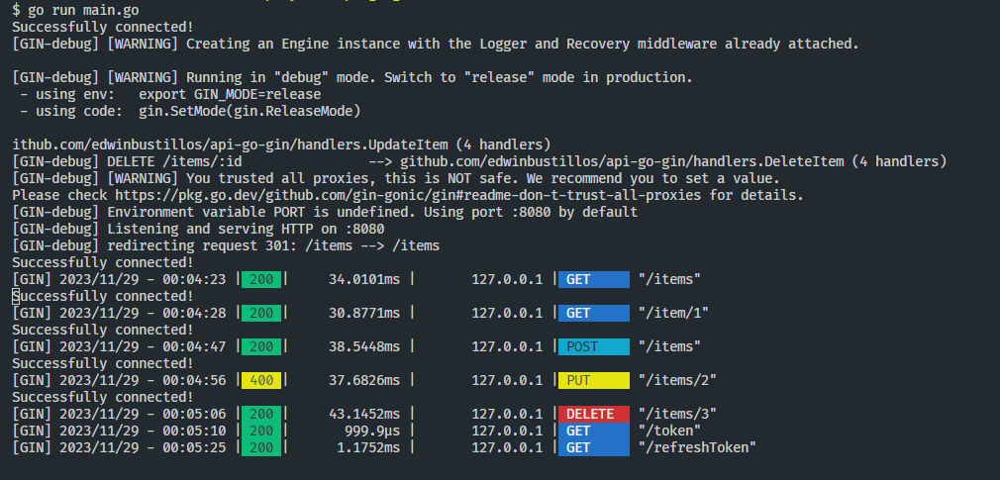

### Projeto GinAPI-GO
---
Este projeto é uma API RESTful construída com o framework Gin e JWT em Go com banco de dados POSTEGRE para efeito didático.

### Endpoints
Aqui estão os endpoints disponíveis:

#### Autenticação
- POST /token: Gera um novo token de acesso.
```
curl --request GET \
  --url http://127.0.0.1:8080/token
```
- POST /refreshToken: Gera um novo token de acesso com base no token de atualização fornecido.
```
curl --request GET \
  --url http://127.0.0.1:8080/refreshToken \
  --header 'Authorization: Bearer {token}'
```

#### Itens
- GET /items: Retorna todos os itens.
```
curl --request GET \
  --url http://127.0.0.1:8080/items/ \
  --header 'Authorization: Bearer {token}'
```
- GET /item/:id: Retorna o item com o ID fornecido.
```
curl --request GET \
  --url http://127.0.0.1:8080/item/{id} \
  --header 'Authorization: Bearer {token}'
```
- POST /items: Cria um novo item.
```
curl --request POST \
  --url http://127.0.0.1:8080/items \
  --header 'Authorization: Bearer {token}' \
  --header 'Content-Type: application/json' \
  --data '{
	"id": 2,
	"name": "teste2",
	"price": 435
}
'
```
- PUT /items/:id: Atualiza o item com o ID fornecido.
```
curl --request PUT \
  --url http://127.0.0.1:8080/items/{id} \
  --header 'Authorization: Bearer {token}' \
  --header 'Content-Type: application/json' \
  --data '{
	"name": "teste2",
	"price": 815
}
'
```

- DELETE /items/:id: Deleta o item com o ID fornecido.
```
curl --request DELETE \
  --url http://127.0.0.1:8080/items/{id} \
  --header 'Authorization: Bearer {token}'
```

### Como executar
1. Clone o repositório.
2. Instale as dependências com `go get` ou `go mod download`.
3. Defina as variáveis de ambiente necessárias no arquivo .env (veja a seção Variáveis de Ambiente abaixo).
4. Execute o programa com go run main.go.
5. Compile com ``go build -o apigo.exe``

#### Variáveis de Ambiente em .env
- PORT_API: Porta principal para subir api.
- SECRET: A chave secreta usada para assinar os tokens JWT. Deve ser uma string longa e aleatória.
- HOST_DB: O Host ou endereço IP
- PORT_DB: A Porta de conexão, geralmente 5432
- USER_DB: O usuário para conexão
- PASSWORD_DB: A senha do usuário para conexão
- DBNAME_DB:  O Nome do banco de dados

#### Tabela ``items`` Banco de Dados PostgreSQL
```SQL
CREATE TABLE items (
    id SERIAL PRIMARY KEY,
    name VARCHAR(100) NOT NULL,
    price DECIMAL(10, 2) NOT NULL
);
```
#### OBS: Voçê subir o banco facilmente para teste ou desenvolvimento com docker compose no link abaixo:
- https://github.com/edwinbustillos/docker-compose-postgre

### Imagem
